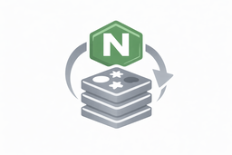

  

# Nginx Cache in Redis wordpress plugin.
Nginx Cache stored in Redis Wordpress implementation. To use only with NGINX HTTP Redis module - https://github.com/osokin/ngx_http_redis

# Nginx Cache in Redis is an admin-side tool that:

- Connects directly to Redis (used by Nginx as a cache store)

- Detects cached pages using a known Nginx key format

- Lists cached URLs in the WordPress admin

- Allows:

-- Full cache flush

-- Per-URL purge

-- Automatic purge on post update

- Provides admin UI + toolbar access

- Verifies configuration and Redis connectivity

# Nginx Cache in Redis wp-config.php Settings

** Update settings according Redis server configuration:**

define('NGINX_REDIS_HOST', '127.0.0.1'); // Redis server host

define('NGINX_REDIS_PORT', 6379); // Redis server port

define('NGINX_REDIS_PREFIX', 'nginx-cache'); // Redis key

define('NGINX_REDIS_DB', 0);               // Redis DB index

define('NGINX_REDIS_AUTH', null);          // 'password' or null

define('NGINX_REDIS_TIMEOUT', 1.5);        // seconds

